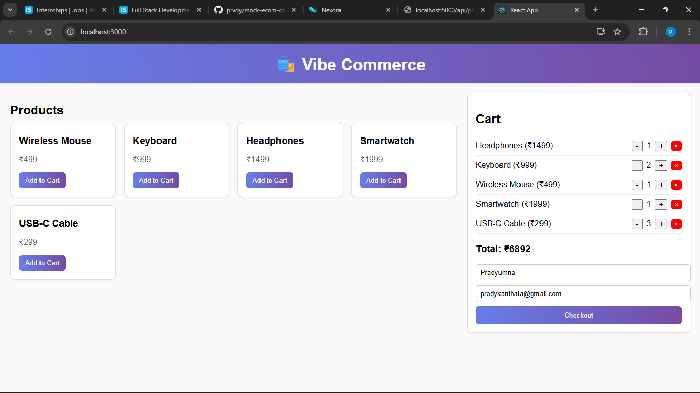
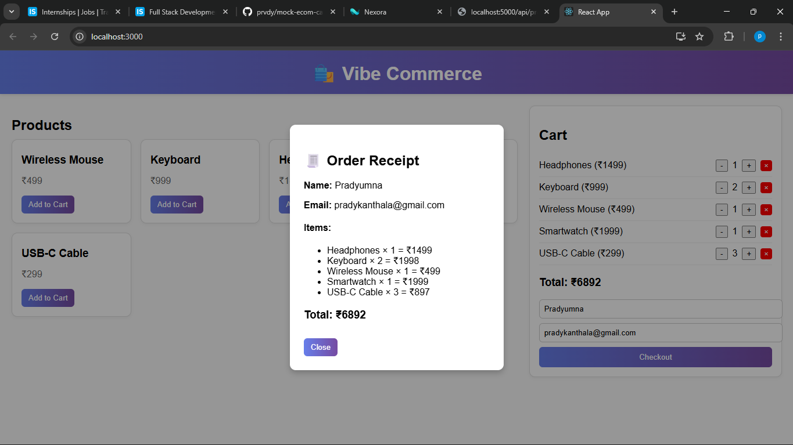

# Mock E-Com Cart

A simple full-stack shopping cart app for Vibe Commerce screening.

---

## Tech Stack
- **Frontend:** React
- **Backend:** Node.js + Express
- **Database:** (None for now – mock data)

---

## 🚀 Features
- View list of products
- Add/remove items from cart
- View total price dynamically
- Checkout with name & email → mock receipt modal

---

## How to Run Locally

### Backend
cd backend
npm install
node server.js

Server runs at http://localhost:5000

### Frontend
cd frontend
npm install
npm start

App opens at http://localhost:3000

## Screenshots

### Products Grid

### Checkout Modal
